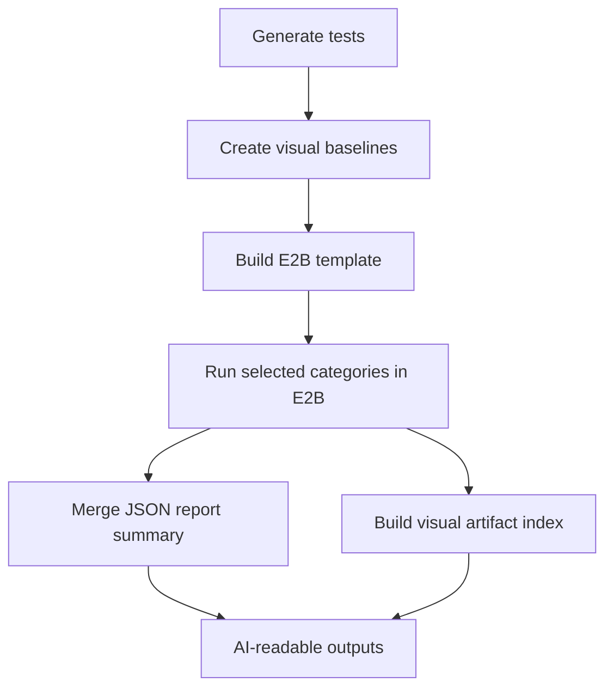

# Playwright + E2B POC File Specification

## 1) What This Project Does

This project runs Playwright tests in parallel E2B sandboxes, collects per-category reports/artifacts, and builds AI-readable summary outputs.

Core POC shape:
- 50 categories
- 10 tests per category
- 500 total tests
- Optional visual regression via screenshot comparison

## 2) High-Level Execution Flow

## 3) File-by-File Specification

## Root Config Files

### [package.json](package.json)
Purpose:
- Defines dependencies and all runnable scripts.

Important scripts:
- `generate:tests`: creates 500 generated tests.
- `test:local`: local Playwright run.
- `test:visual:baseline`: creates/updates snapshot baselines.
- `test:visual:cat01`: quick visual verification for one category.
- `template:build:dev` and `template:build:prod`: builds E2B templates.
- `test:e2b:parallel`: E2B orchestration entry point.
- `test:e2b:cat01`: single-category E2B run.
- `test:e2b:failed`: rerun failed categories from prior summary.
- `report:e2b:merge`: merged JSON/Markdown summary.
- `report:e2b:visual-index`: AI-focused visual index.
- `report:e2b:all`: runs both report steps.

### [.env.example](.env.example)
Purpose:
- Documents required and optional environment variables.

Variables:
- `E2B_API_KEY`: authentication for E2B SDK.
- `E2B_TEMPLATE`: template alias to use during sandbox creation.
- `E2B_PARALLEL_INSTANCES`: max in-flight category jobs.
- `E2B_TIMEOUT_MS`: sandbox timeout.
- `ENABLE_VISUAL`: toggle screenshot assertion in generated tests.

### [playwright.config.mjs](playwright.config.mjs)
Purpose:
- Local execution config tuned for stable screenshots.

Behavior:
- Uses `tests/generated` as test root.
- Uses `list` reporter for terminal readability.
- Uses deterministic viewport + screenshot settings.
- Writes runtime artifacts to `test-results`.

### [playwright.config.e2b.mjs](playwright.config.e2b.mjs)
Purpose:
- E2B execution config tuned for machine-readable reporting.

Behavior:
- Same test/runtime settings as local config.
- Uses `json` reporter for downstream merge/index scripts.

### [.gitignore](.gitignore)
Purpose:
- Excludes runtime/generated artifacts and secrets from version control.

## E2B Template Files

### [e2b/template.mjs](e2b/template.mjs)
Purpose:
- Declares the sandbox template used by E2B runs.

Main actions:
- Starts from E2B base image.
- Copies app assets needed for testing (`package.json`, E2B config, tests).
- Installs runtime dependencies and Chromium at template build time.
- Defines a simple start command indicating readiness.

### [scripts/build-template.dev.mjs](scripts/build-template.dev.mjs)
Purpose:
- Builds lower-resource template alias `playwright-runner-dev`.

Inputs:
- `E2B_API_KEY` from environment.

Output:
- Published template in E2B account under dev alias.

### [scripts/build-template.prod.mjs](scripts/build-template.prod.mjs)
Purpose:
- Builds higher-resource template alias `playwright-runner`.

Inputs:
- `E2B_API_KEY` from environment.

Output:
- Published template in E2B account under prod alias.

## Test Generation and Local Parallel Files

### [scripts/generate-tests.mjs](scripts/generate-tests.mjs)
Purpose:
- Rebuilds `tests/generated` with deterministic category-based tests.

Main logic:
- Deletes and recreates `tests/generated`.
- Generates `cat01.spec.ts` through `cat50.spec.ts`.
- Creates 10 tests per file.
- Adds `@catXX` tags for selective execution.
- Applies visual assertion when `ENABLE_VISUAL` is not `false`.

Output:
- Generated test files under [tests/generated](tests/generated).

### [scripts/run-local-50-shards.mjs](scripts/run-local-50-shards.mjs)
Purpose:
- Local benchmark helper to run all 50 Playwright shards in parallel.

Behavior:
- Spawns 50 shard commands.
- Aggregates exit codes.
- Fails process if any shard fails.

## E2B Execution and Reporting Files

### [scripts/run-e2b-parallel.mjs](scripts/run-e2b-parallel.mjs)
Purpose:
- Main orchestrator for remote sandbox execution.

Category selection modes:
- Default: all categories (`cat01..cat50`).
- Single category: `--category=cat01`.
- Multiple categories: `--categories=cat01,cat07`.
- Env list: `E2B_CATEGORIES=cat01,cat07`.
- Failed rerun: `--failed-from=reports/e2b/run-summary.json`.

Per-category execution pipeline:
- Creates sandbox from selected template.
- Runs category-filtered Playwright command in sandbox.
- Saves per-category JSON report to `reports/e2b/raw/<category>.json`.
- Saves compressed artifact bundle to `reports/e2b/artifacts/<category>-artifacts.tgz`.
- Always kills sandbox in `finally` block.

Run summary output:
- `reports/e2b/run-summary.json`
- Includes selection mode, selected categories, per-category entries, success/failure totals.

Exit behavior:
- Exits non-zero when any selected category fails.

### [scripts/merge-e2b-results.mjs](scripts/merge-e2b-results.mjs)
Purpose:
- Consolidates per-category JSON report files into one summary.

Input:
- `reports/e2b/raw/*.json`

Outputs:
- `reports/e2b/merged-summary.json` (machine-friendly totals + category rows)
- `reports/e2b/merged-summary.md` (human-friendly table)

Error tolerance:
- Handles malformed/missing JSON by marking rows as malformed instead of crashing.

### [scripts/build-visual-index.mjs](scripts/build-visual-index.mjs)
Purpose:
- Creates AI-readable mapping of visual comparison artifacts.

Inputs:
- `reports/e2b/artifacts/*-artifacts.tgz`
- Optional test metadata from `reports/e2b/raw/<category>.json`

Main logic:
- Extracts each category archive into `reports/e2b/extracted/<category>`.
- Scans PNGs and groups visual triplets by stem:
  - expected image
  - actual image
  - diff image
- Joins group rows with Playwright status/errors when possible.

Outputs:
- `reports/e2b/visual-index.json` (AI-focused structured index)
- `reports/e2b/visual-index.md` (quick review summary)

## Documentation File

### [README.md](README.md)
Purpose:
- Beginner-oriented setup and runbook for end-to-end usage.

Scope:
- Installation, env setup, baseline generation, template build, E2B execution, report generation.

## 4) Output Contract (Important Paths)

Primary runtime artifacts:
- `reports/e2b/run-summary.json`
- `reports/e2b/raw/*.json`
- `reports/e2b/artifacts/*-artifacts.tgz`
- `reports/e2b/merged-summary.json`
- `reports/e2b/merged-summary.md`
- `reports/e2b/visual-index.json`
- `reports/e2b/visual-index.md`
- `reports/e2b/extracted/**` (expanded artifact contents)

Test generation output:
- `tests/generated/*.spec.ts`
- `tests/generated/*-snapshots` (baseline snapshots)

## 5) Operational Runbook

Recommended full run:
1. `npm install`
2. `npm run generate:tests`
3. `npm run test:visual:baseline`
4. `npm run template:build:dev`
5. `npm run test:e2b:parallel`
6. `npm run report:e2b:all`

Targeted rerun examples:
1. Single category: `npm run test:e2b:cat01`
2. Custom list: `node scripts/run-e2b-parallel.mjs --categories=cat01,cat07,cat23`
3. Failed-only rerun: `npm run test:e2b:failed`

## 6) Notes For New Contributors

- Generated tests are intentionally deterministic; rerunning generation replaces existing generated files.
- Visual baselines must be regenerated and template rebuilt if visual assertions or UI baseline content changes.
- E2B run command intentionally always attempts artifact collection per category, even for failed tests.
- The visual index script is additive: it does not execute tests, it only processes already collected artifacts/reports.
